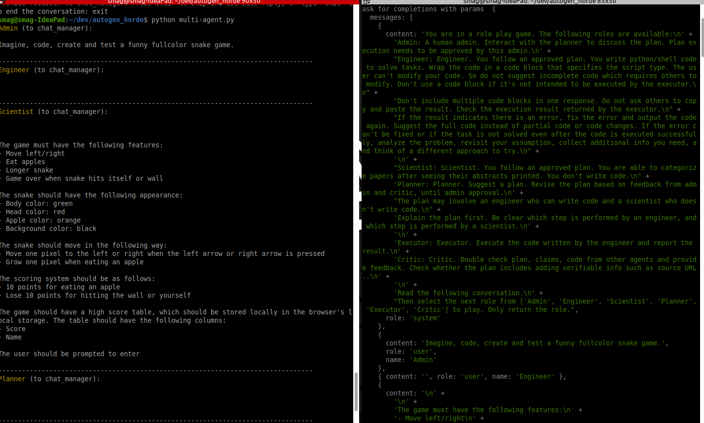
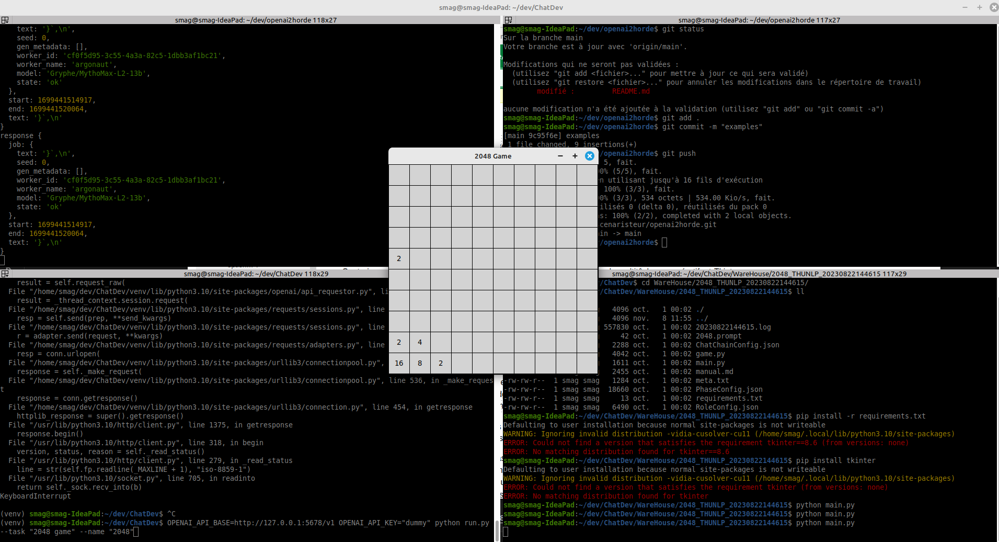
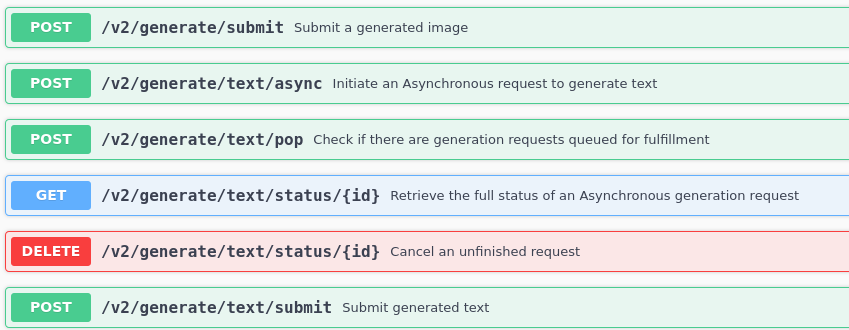

# openai2horde

- [X] microsoft/autogen to Horde
- [ ] OpenAgents to Horde https://github.com/xlang-ai/OpenAgents & https://www.youtube.com/watch?v=htla3FzJTfg
- [ ] AutoGPT to Horde https://github.com/Significant-Gravitas/AutoGPT WIP
- [X] ChatDev to Horde https://github.com/OpenBMB/ChatDev
- [ ] Deepseek coder to Horde  (does not use openai ?) https://www.youtube.com/watch?v=QPBmsgGufXE & https://deepseekcoder.github.io/ & https://github.com/deepseek-ai/deepseek-coder/


# autogen examples
some tests are in root folder
- https://microsoft.github.io/autogen/docs/Examples/AgentChat




# with Chatdev
`(venv) ~/dev/ChatDev$ OPENAI_API_BASE=http://127.0.0.1:5678/v1 OPENAI_API_KEY="dummy" python run.py --task "2048 game" --name "2048"`



openai2horde allow you to use openai based tools like Microsoft Autogen, Auto-GPT and so many more in a decentralized way using Db0 Horde https://stablehorde.net/ & https://github.com/Haidra-Org/AI-Horde

The horde is a crowdsourced distributed cluster of Image generation workers and text generation workers. If you like this service, consider joining the horde yourself!

For more information, check the [FAQ](https://github.com/Haidra-Org/AI-Horde/blob/main/FAQ.md). Finally you can also follow the main developer's blog

- become a  horde worker https://github.com/Haidra-Org/AI-Horde-Worker#readme

- see horde text workers [Scribes](https://stablehorde.net/api/v2/workers?type=text)

# stable horde api

https://github.com/Haidra-Org/AI-Horde/blob/5f0a0b13c96ea70205fcc1b01b380a6e6738047b/horde/apis/v2/kobold.py




# get openai2horde
```
git clone https://github.com/scenaristeur/openai2horde.git
cd openai2horde
npm install

```

# add your horde api key
- renamme .env-example to .env
and complete with your horde api key , see https://stablehorde.net/register and https://stablehorde.net/

# start openai2horde
`npm run start`
--> openai2horde is accessed at http://localhost:5678/v1

# run autogen two_agents.py
`python two_agents.py`


# dev
run `npm run dev`

# todo
- [ ] test multi-agents with postgres https://www.youtube.com/watch?v=JjVvYDPVrAQ&t=3s
- [ ] see guidance https://github.com/guidance-ai/guidance


# with autogpt
.env : OPENAI_API_BASE_URL=http://localhost:5678/v1

Auto-GPT-0.4.7$ ./run.sh -m json_file --speak

All packages are installed.
2023-11-07 14:54:45.995265: I tensorflow/core/platform/cpu_feature_guard.cc:182] This TensorFlow binary is optimized to use available CPU instructions in performance-critical operations.
To enable the following instructions: AVX2 FMA, in other operations, rebuild TensorFlow with the appropriate compiler flags.
Speak Mode:  ENABLED
WARNING:  You do not have access to gpt-3.5-turbo. Setting fast_llm to gpt-3.5-turbo.
WARNING:  You do not have access to gpt-4-0314. Setting smart_llm to gpt-3.5-turbo.
NEWS:  Welcome to Auto-GPT!
NEWS:  
NEWS:  
Welcome to Auto-GPT!  run with '--help' for more information.
Create an AI-Assistant:  input '--manual' to enter manual mode.
  Asking user via keyboard...
I want Auto-GPT to:


